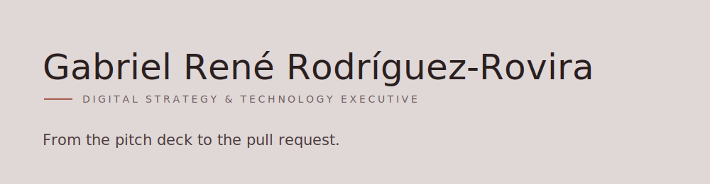
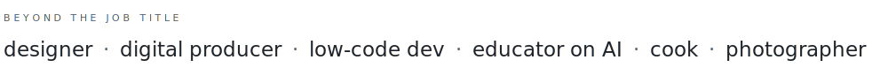
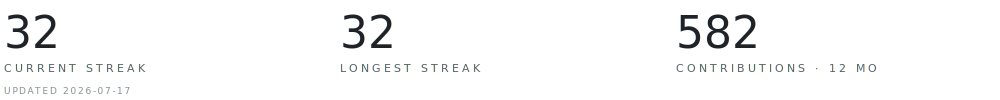

<picture>
  <source media="(prefers-color-scheme: dark)" srcset="./assets/header-dark.svg">
  
</picture>

I run digital strategy and technology at [de la Cruz](https://github.com/DELACRUZ-GROUP), one of the largest agencies in the Caribbean. My teams win the awards (Cannes, Effie, El Ojo, Cúspide, SME), and I build the products behind them. Most executives stop at the deck. I open the editor.

### Strategy
Fifteen-plus years across advertising, digital production, political campaigns, and crisis work throughout the Americas. Two digital agencies bootstrapped, a 40-person department and a $2M budget run.

### Building
Low-code when it’s faster, full-code when it isn’t. Next.js, TypeScript, and whatever the problem actually needs. I ship the tools my teams pitch.

### Teaching AI
Speaker and educator on human-centered AI: universities, marketing and PR associations, and industry forums across Puerto Rico and Latin America. I care more about how this technology changes us than about the demos.

<picture>
  <source media="(prefers-color-scheme: dark)" srcset="./assets/identities-dark.svg">
  
</picture>

### Selected work

**[margin-muse](https://github.com/gabriel-rene/margin-muse):** a writing editor that feels like paper, where the AI asks questions about your prose instead of rewriting it. *Next.js · Tiptap · Anthropic.*

**[gaborene-com](https://github.com/gabriel-rene/gaborene-com):** my personal site. Next.js 16, Tailwind v4, and deliberately unfashionable typography. *Also a cook, a photographer, and a curious mind. The long version lives here.*

<picture>
  <source media="(prefers-color-scheme: dark)" srcset="./assets/stats-dark.svg">
  
</picture>

### Currently

Building **margin-muse**, and looking for the next thing worth teaching or making. If you want to explore what we could do together, reach out.

[Website](https://gabrielrodz.com) · [LinkedIn](https://www.linkedin.com/in/gabrielrene) · [X](https://x.com/gabrielrodz)
